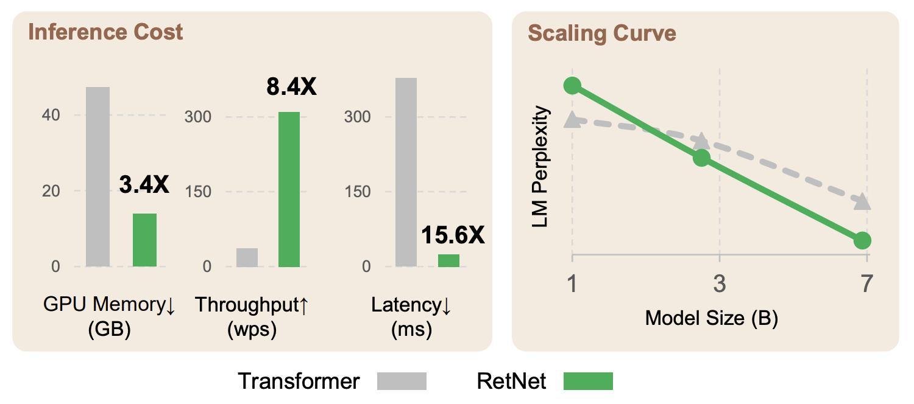
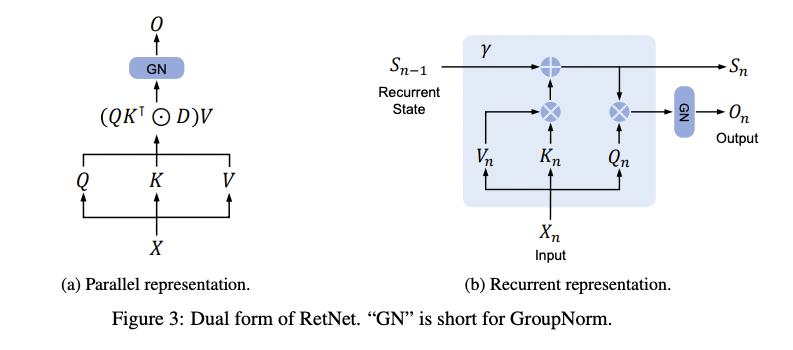
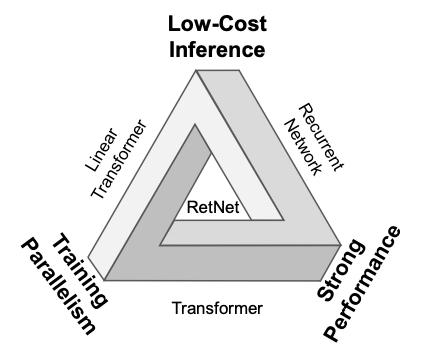
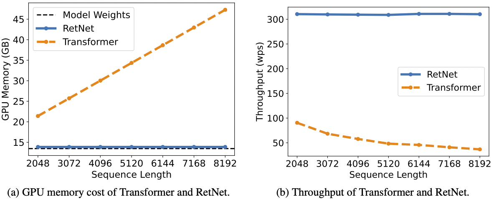
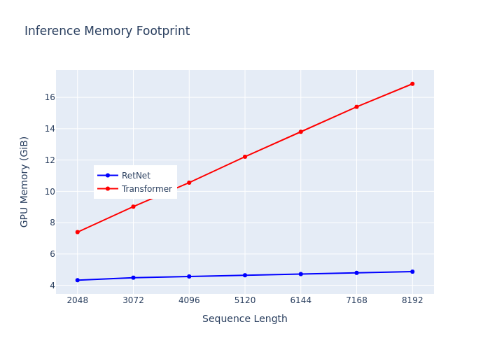
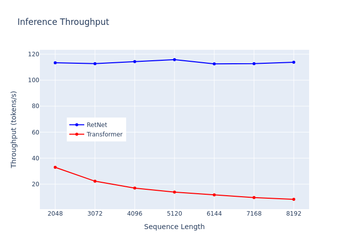

# yet-another-retnet

A simple but robust PyTorch implementation of RetNet from [Retentive Network: A Successor to Transformer for Large Language Models](https://arxiv.org/pdf/2307.08621.pdf).

> Also see Microsoft's original implementation: [RetNet @ microsoft/torchscale](https://github.com/microsoft/torchscale/blob/main/torchscale/architecture/retnet.py)
>
> Ultimately, their implementation is the ground truth.  I have tried to make my implementation as readable and well-documented as possible, while still being consistent with the original.  My version also includes full type annotations, and a robust set of unit tests.
>
> I'm obviously biased, but I find the untyped, config-driven approach in [microsoft/torchscale](https://github.com/microsoft/torchscale/tree/main) clunky and difficult to adapt to other use cases.




### TODO

- [x] Equivalent **parallel** and **recurrent** retention methods.  See: [retention.py](yet_another_retnet/retention.py)
- [x] Recurrent position embedding implementation.
- [x] `MultiScaleRetention` module.  See: [retention.py](yet_another_retnet/retention.py)
- [x] Make relative position embeddings for `MultiScaleRetention` **optional**.
    - The retention layer explicitly includes a position embedding update, which is based on [xPos](https://arxiv.org/pdf/2212.10554.pdf).  It does not necessarily translate well to other domains (e.g. computer vision, heterogeneous graphs).  So, I have made it optional.
    - I'm not 100% sure why the authors did this.  It seems overly specific to the language modeling use case, and it's not clear to me that it was necessary.
- [x] End-to-end `RetNet` module.  See: [retnet.py](yet_another_retnet/retnet.py)
    - [x] `RetNetDecoderLayer`
    - [x] `RetNetDecoder`
- [x] Preconfigured 1.3B, 2.7B, and 6.7B models (untrained).  See: [retnet.py](yet_another_retnet/retnet.py)
- [x] Reproduce inference memory and throughput benchmarks from the paper.  See: [Inference Benchmarks](#inference-benchmarks), [benchmark_inference.py](scripts/benchmark_inference.py)
- [x] Release stable version on PyPI.
    - [x] Prerelease
    - [x] Stable
- [x] Equivalent **chunkwise** retention method.
- [x] Basic training example for language modeling.  See: [train_project_gutenberg.py](./scripts/train_project_gutenberg.py)


## Install

PyPI:
```bash
pip install yet-another-retnet
```

> **NOTE**: To run the [example training script](./scripts/train_project_gutenberg.py), you will need to include the `[train]` extra package:
> ```bash
> pip install yet-another-retnet[train]
> ```

From source:
```bash
pip install "yet-another-retnet @ git+ssh://git@github.com/fkodom/yet-another-retnet.git"
```

For contributors:
```bash
# Clone/fork the repository
gh repo clone fkodom/yet-another-retnet
cd yet-another-retnet
# Install all dev dependencies (tests etc.) in editable mode
pip install -e .[test]
# Setup pre-commit hooks
pre-commit install
```


## About

RetNet is a transformer-like architecture that has equivalent **parallel** and **recurrent** formulations.




The benefits of this dual formulation are:
- Accuracy comparable to Transformer-based models
- **Parallel**: high training throughput
- **Recurrent**: high inference throughput

This is the "impossible triangle" of language model design, as described by the authors:




## Usage

### RetNet

Use one of the configurations described in the paper:
- `retnet_1_3b`
- `retnet_2_7b`
- `retnet_6_7b`

```python
from yet_another_retnet.retnet import retnet_1_3b

retnet = retnet_1_3b(num_tokens=10000, device="cuda")
```

or create your own `RetNet` model directly:

```python
from yet_another_retnet.retnet import RetNet

# a very small RetNet model :D
retnet = RetNet(
    num_tokens=1000, # vocab size, usually taken from tokenizer
    d_model=64,
    nhead=4,
    num_layers=2,
    device="cuda",
).eval()  # Important for reproducibility!
```

Equivalent parallel, recurrent, and chunkwise usage:

```python
import torch

# Set deterministic CUDA ops
torch.backends.cudnn.deterministic = True
torch.backends.cudnn.benchmark = False

# input shape: (batch_size, seq_len)
# integer range: [0, num_tokens)
x = torch.randint(0, 1000, (1, 16), device="cuda")

# Parallel usage
y_parallel = retnet.forward_parallel(x)

# Recurrent usage
outputs = []  # container for collecting step-wise outputs
prev_states = []  # cache layer states after each step
for idx in range(16):  # seq_len
    out, prev_states = retnet.forward_recurrent(x[:, idx], idx, prev_states)
    outputs.append(out)
y_recurrent = torch.stack(outputs, dim=1)

# Chunkwise usage
outputs = []  # container for collecting chunk-wise outputs
prev_states = []  # cache layer states after each step
chunk_size = 4  # number of tokens in each chunk
for idx in range(0, 16, chunk_size):
    out, prev_states = retnet.forward_chunkwise(
        x[:, idx : idx + chunk_size], idx, prev_states
    )
    outputs.append(out)
y_chunkwise = torch.cat(outputs, dim=1)

# Check that outputs are equal
torch.testing.assert_close(y_parallel, y_recurrent)
torch.testing.assert_close(y_parallel, y_chunkwise)
```

**NOTE**: There is some floating point error accumulation in the recurrent formulation, which I believe is less pronounced in the parallel formulation. Especially for untrained models (when activations are very large), the two outputs may not match *exactly*.  The absolute difference should still be very small -- on the order of 1e-5 or less.


### MultiScaleRetention

Equivalent parallel, recurrent, and chunkwise usage:

```python
import torch

from yet_another_retnet.retention import MultiScaleRetention

mhr = MultiScaleRetention(embed_dim=32, num_heads=4, device="cuda").eval()

# input shape: (batch_size, seq_len, embed_dim)
q = k = v = torch.randn(1, 16, 32, device="cuda")

# Parallel retention
y_parallel, _ = mhr.forward_parallel(q, k, v)

# Recurrent retention
outputs = []
prev_state = None
for idx in range(16):
    out, prev_state = mhr.forward_recurrent(
        q[:, idx], k[:, idx], v[:, idx], idx, prev_state
    )
    outputs.append(out)
y_recurrent = torch.stack(outputs, dim=1)

# Chunkwise retention
outputs = []
prev_state = None
chunk_size = 4
for idx in range(0, 16, chunk_size):
    out, prev_state = mhr.forward_chunkwise(
        q[:, idx : idx + chunk_size],
        k[:, idx : idx + chunk_size],
        v[:, idx : idx + chunk_size],
        idx,
        prev_state,
    )
    outputs.append(out)
y_chunkwise = torch.cat(outputs, dim=1)

# Check that outputs are equal
torch.testing.assert_close(y_parallel, y_recurrent)
torch.testing.assert_close(y_parallel, y_chunkwise)
```

**NOTE**: The `MultiScaleRetention` that is described in the paper includes an
explicit position embedding (based on xPos) as part of the retention layer.  This
does not translate perfectly to other domains (e.g. computer vision, heterogeneous
graphs), so I have made it optional.

Set `relative_position=False` to disable the position embedding.  Instead, you will
be responsible for adding positional information to the inputs (if needed).

```python
# Disable relative position embedding
mhr = MultiScaleRetention(
    embed_dim=32, num_heads=4, relative_position=False, device="cuda"
)
# Everything else works the same as above.
# Just add your own positional embeddings to the inputs.
```

### Retention forward pass

Similar to the example above, but head projections and positional updates are not internalized by `MultiScaleRetention`:

```python
import torch

from yet_another_retnet.retention import (
    retention_chunkwise,
    retention_parallel,
    retention_recurrent,
)

# input shape: (batch_size, num_heads, seq_len, head_dim)
q = k = v = torch.randn(1, 4, 32, 8, device="cuda")

# Parallel retention
y_parallel, _ = retention_parallel(q, k, v)

# Recurrent retention
outputs = []
prev_state = None
for i in range(32):
    out, prev_state = retention_recurrent(q[:, :, i], k[:, :, i], v[:, :, i], prev_state)
    outputs.append(out)
y_recurrent = torch.stack(outputs, dim=2)

# Chunkwise retention
outputs = []
prev_state = None
chunk_size = 4
for i in range(0, 32, chunk_size):
    out, prev_state = retention_chunkwise(
        q[:, :, i : i + chunk_size],
        k[:, :, i : i + chunk_size],
        v[:, :, i : i + chunk_size],
        prev_state,
    )
    outputs.append(out)
y_chunkwise = torch.cat(outputs, dim=2)

# Check that outputs are equal
torch.testing.assert_close(y_parallel, y_recurrent)
torch.testing.assert_close(y_parallel, y_chunkwise)
```


## Inference Benchmarks

> **NOTE**: The benchmarks aren't exact one-to-one comparisons, because I have a much lower-end GPU.  The authors benchmark RetNet 6.7B using an A100 80GB.  I have a 2080 Ti (11GB), so I chose to benchmark RetNet 1.3B instead.  I expect the batch size is also smaller in my benchmarks, although the authors don't specify what their batch size was.
> 
> My benchmarks clearly show the same scaling trends, which is still helpful as a rough validation.

From the paper:



From this repo:

<p float="left">
    
    
</p>


## Parallel vs. Recurrent vs. Chunkwise

When should you choose one formulation over the others?  Here is a general rule of thumb:

* Parallel -> model training
* Recurrent -> incremental token prediction
* Chunkwise ->
    1. model training -- if training inputs are very long, and parallel formulation is too memory intensive
    2. encoding long prompts -- if inference *prompts* are very long, chunkwise encoding is more efficient than the recurrent formulation.  The state returned from chunkwise formulation is the same as in recurrent formulation.  So, once the prompt is chunkwise encoded, use recurrent formulation to generate new tokens.


## Citations

```bibtex
@misc{sun2023retentive,
      title={Retentive Network: A Successor to Transformer for Large Language Models}, 
      author={Yutao Sun and Li Dong and Shaohan Huang and Shuming Ma and Yuqing Xia and Jilong Xue and Jianyong Wang and Furu Wei},
      year={2023},
      eprint={2307.08621},
      archivePrefix={arXiv},
      primaryClass={cs.CL}
}
```
